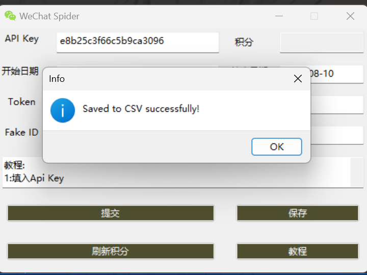

## 设置步骤

1. **填入API Key：**
   - 找到项目目录下的`config.json`文件。
   - 在指定位置填入您的API Key。

2. **获取Token和Fake ID：**
   - 在电脑上登录您的微信公众号。
   - 通过开发者工具（F12）找到`Token`和`Fake ID`。

3. **更新Token、Fake ID和Cookie：**
   - 填入获取到的`Token`和`Fake ID`。
   - 修改项目目录下的`cookie.txt`文件，填写最新的Cookie信息。

4. **设置时间范围（可选）：**
   - 在界面中输入数据获取的开始时间和结束时间。
   - 确保时间格式正确（`YYYY-MM-DD`）。
   - 如果未提供时间范围，工具将默认抓取所有可用数据。

5. **提交：**
   - 点击“提交”按钮，开始数据获取过程。

6. **保存数据：**
   - 数据获取完成后，点击“保存”按钮，将结果导出为CSV文件。

7. **刷新积分：**
   - 点击“刷新积分”按钮，查看剩余可用积分。

## 附加信息
成功图片如下：  

